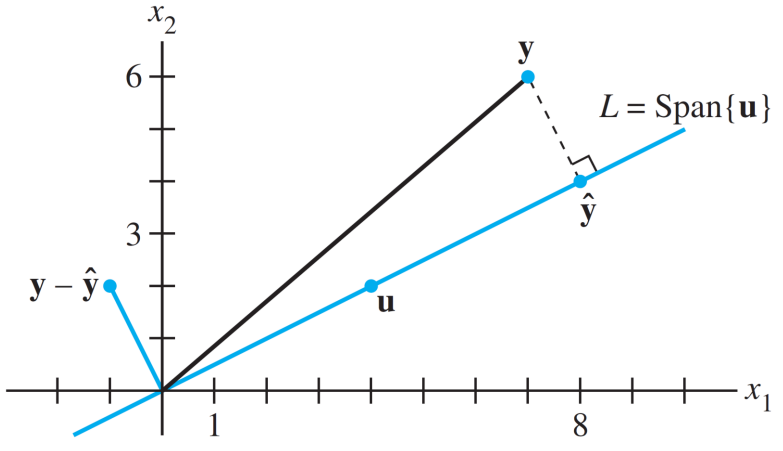
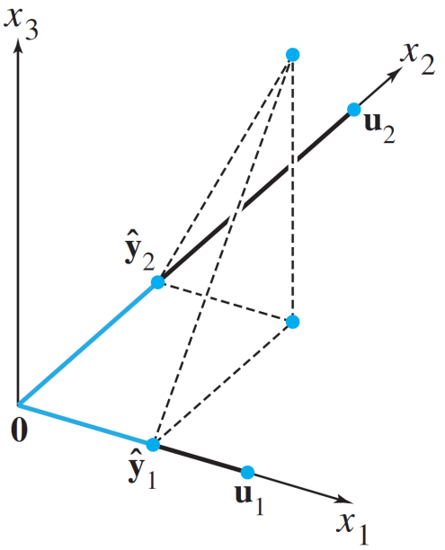

## Orthogonal and Orthonormal Sets

Orthogonal Set : $\\{\mathbf{u_{1}}, \mathbf{u_{2}}, ..., \mathbf{u_{p}}\\}$의 벡터집합에서 임의의 두 벡터의 내적값이 0을 만족하는 집합.   
Orthonormal Set : Orthogonal Set에서 모든 벡터의 크기가 1을 만족하는 집합.

Orthogonal Set은 항상 linearly independent하다.

 

## Orthogonal Projection

Least Square Problem에서 $\mathbf{b}$의 orthogonal projection은 $\mathbf{\hat{b}}$
$$\mathbf{\hat{b}} = f(\mathbf{b}) = A\hat{\mathbf{x}} = A(A^{T}A)^{-1}A^{T}\mathbf{b}$$
$$\mathbf{\hat{x}} = (A^{T}A)^{-1}A^{T}\mathbf{b}, \quad f(\mathbf{b}) = A(A^{T}A)^{-1}A^{T}$$
즉, b라는 임의의점에서 ColA에 정사영을 시켜주는 linear transformation   
만약 $\mathbf{b}$가 SpanA 위의 점이라면, $\mathbf{b} = \mathbf{\hat{b}}$

- Orthogonal Projection $\mathbf{\hat{y}}$ of $\mathbf{y}$ onto line   

  1. $\mathbf{y}$를 Span{u}에 projection한 $\mathbf{\hat{y}}$의 크기를 구한다.
  $$\lVert\mathbf{\hat{y}}\rVert = \lVert\mathbf{y}\rVert \cos{\theta} = {\mathbf{y} \cdot \mathbf{u} \over \lVert \mathbf{u} \rVert} \quad (\because \mathbf{y} \cdot \mathbf{u} = \lVert \mathbf{y} \rVert \lVert \mathbf{u} \rVert \cos{\theta})$$
  2. $\mathbf{u}$ 방향의 단위벡터를 곱해준다.
  $$\mathbf{\hat{y}} = {\mathbf{y} \cdot \mathbf{u} \over \lVert \mathbf{u} \rVert}{1 \over \lVert \mathbf{u} \rVert}\mathbf{u} \qquad if\ \mathbf{u}\ is\ a\ unit\ vector,\quad \mathbf{\hat{y}} = (\mathbf{y} \cdot \mathbf{u})\mathbf{u}$$
  3. $\mathbf{y} - \mathbf{\hat{y}}$
  
- Orthogonal Projection $\mathbf{\hat{y}}$ of $\mathbf{y}$ onto plane(Orthogonal basis)   

  1. 각각의 basis vector에 projection한 $\mathbf{\hat{y}}$ 의 크기를 구한다.
  $$\lVert\mathbf{\hat{y}}\rVert = {\mathbf{y} \cdot \mathbf{u}_{n} \over \mathbf{u} \cdot \mathbf{u}}$$
  2. 각각의 basis vector 방향의 단위벡터를 곱해준다.
  3. basis vector들은 orthogonal하므로, 모두 더하면 평면에 projection한 $\mathbf{\hat{y}}$를 구할 수 있다. 
