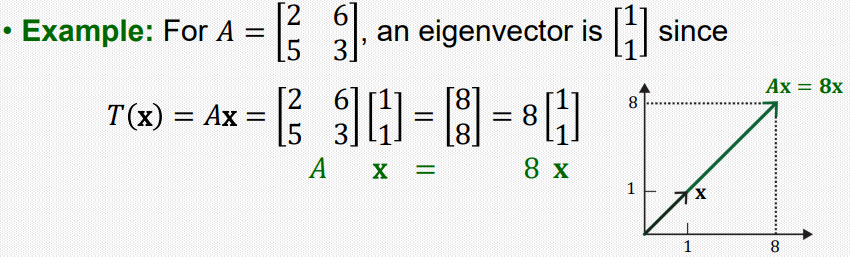

## Eigenvectors and Eigenvalues

$$A\mathbf{x} = \lambda\mathbf{x} \qquad A\in\mathbb{R}^{n\times n}, \ \mathbf{x} \ne \mathbf{0}$$

위 식을 만족하는 영이 아닌 벡터 $\mathbf{x}$를 $A$의 eigenvector, $\lambda$를 $A$의 eigenvalue 라고 한다.

 

**\<선형 변환 관점에서의 고유벡터, 고유값>**

선형 변환 $T( \mathbf{x} )=A\mathbf{x}$를 생각해보자.   
일반적으로 선형변환은 입력벡터의 방향과 크기를 모두 바꿔준다.   
만약 입력벡터가 $A$의 고유벡터라면, 선형변환 $A$는 고유벡터에 대하여 방향은 바꿔주지 않고 그 크기만 고유값만큼 변환해준다.

 

**\<고유벡터, 고유값 구하기>**

$$A\mathbf{x} = \lambda\mathbf{x} \ \to \ (A-\lambda I)\mathbf{x} = \mathbf{0}$$

$\mathbf{x}$는 nonzero vector 이므로 위 방정식은 non-trivial solution을 가진다는 말이고, 따라서 $A-\lambda I$ 는 linearly dependent 해야한다.

따라서 $\det(A-\lambda I) = 0$ 이 되어야 한다.   
여기서 $\det(A-\lambda I) = 0$ 를 A의 **Characteristic Equation(특성방정식)** 이라 한다.

Ex.

$$A = \begin{bmatrix}
2 & 6 \\
5 & 3
\end{bmatrix}, \quad A-\lambda I = \begin{bmatrix}
2-\lambda & 6 \\
5 & 3-\lambda
\end{bmatrix}$$

$$\det(A-\lambda I) = (2-\lambda)(3-\lambda)-30 = 0, \quad \therefore \lambda = -3 \ or \ 8$$

